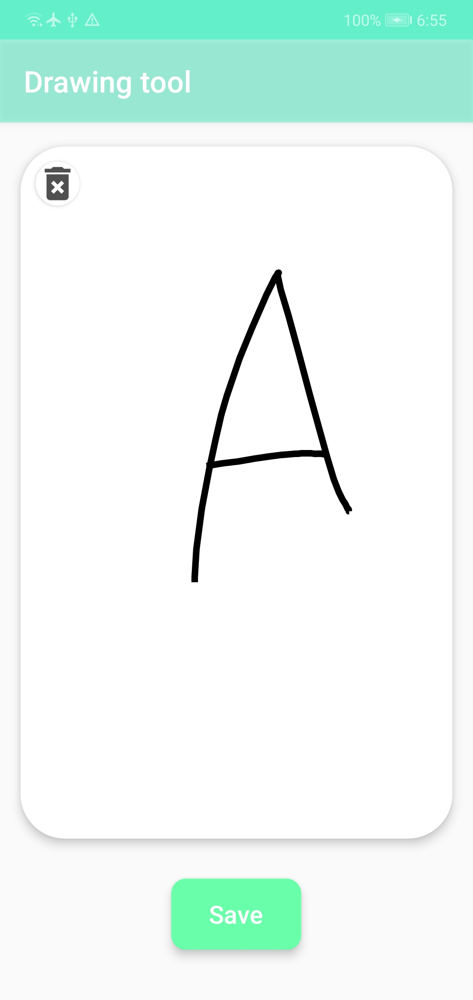
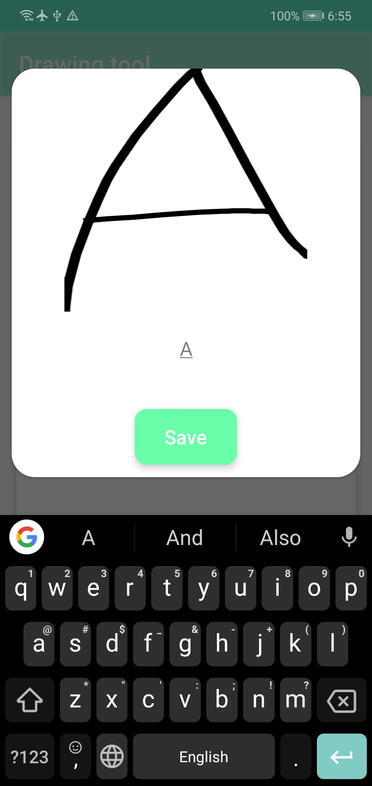
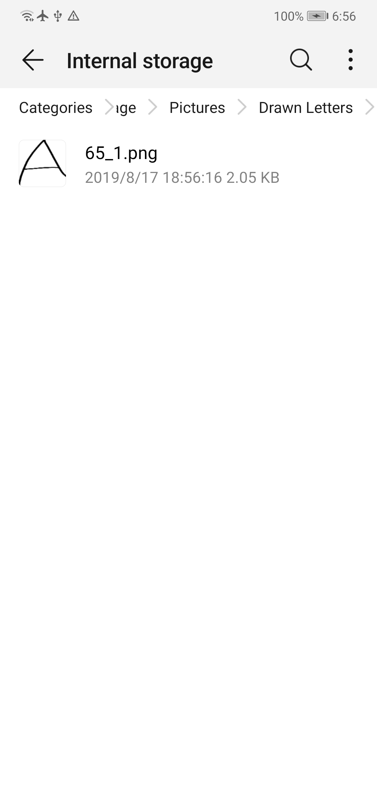

# Android Drawing Tool
### Description
This is a small Android App that enables you to draw freely on on a custom built view, that is easily modifiable. 
And after being the Picasso you are, you can now share the works of your finger as a PNG. And if you wish you can tweak it to give you the bitmap you just drew in any size you want.

### Secret Ingredient
Painter is a java class that extends View with major attributes such as brush size and color, and more.

### Note
If you would like helping me in an upcoming Deep Learning Project you can use it to generate hand drawn images for ASCII characters, that will be saved in your android Pictures folder under Drawn Letters folder.
If you want, you can send me those images unmodified on this email: matex512@gmail.com. Also, please don't change the file names what so ever.

### Example
- Drawing

- Assigning corresponding character

- Viewing

